# Полный технический и архитектурный аудит проекта Task Manager

Дата аудита: 22 мая 2026  
Проект: `Diplom` / `Task Manager`  
Рабочая директория: `C:\Users\Mr_beer\Documents\Projects\study\python\Diplom`  
Тип аудита: senior/full technical architecture audit

## Executive Summary

Проект представляет собой учебную fullstack web app систему управления задачами в стиле Kanban. Система включает frontend на React и backend на FastAPI, использует SQLite как локальную БД, JWT для аутентификации, ролевую модель доступа и простой чат внутри задачи.

Основной функционал уже реализован и фактически собирается: `npm run build` завершился успешно, Python-модули компилируются, `pip check` не нашел конфликтов Python-зависимостей. Архитектурно проект понятен и достаточно цельный для учебной/курсовой работы, но до production-ready состояния есть значимые разрывы: слабая безопасность хранения паролей, plaintext-пароли в БД и API, открытый CORS, дефолтный `SECRET_KEY`, SQLite-файл в git, отсутствие миграций, тестов, CI/CD, Docker и полноценного разделения backend-слоев.

Ключевой вывод: проект находится на уровне working prototype / учебный MVP. Для коммерческого использования его нельзя выпускать без срочного hardening security, нормализации хранения secrets, отказа от plaintext-паролей, миграций, тестов, production-конфигурации и реорганизации backend-логики в service/repository слои.

## 1. Общее описание проекта

| Параметр | Вывод |
|---|---|
| Название | `Task Manager`, репозиторий `Diplom` |
| Назначение | Управление задачами на Kanban-доске с ролями, назначением исполнителей и обсуждениями |
| Проблема | Нужен простой инструмент для постановки задач, отслеживания статусов, контроля сотрудников и обсуждения задач |
| Тип проекта | Fullstack web app, dashboard/task-management system, учебный MVP |
| Основная бизнес-логика | Задачи проходят статусы, назначаются пользователям, доступны по ролевой иерархии, имеют чат |
| Пользователи | `admin`, `ceo`, `manager`, `employee` |

Проект решает задачу внутреннего управления работой небольшой команды. Центральная сущность системы - `Task`. Вокруг нее построены:

- Kanban-доска со статусами.
- Ролевая видимость задач.
- Назначение исполнителя.
- Создание и редактирование задач.
- Управление пользователями.
- Чат по задаче.

Правила доступа реализованы на backend в `backend/app/api/tasks.py` через ранги:

```python
ROLE_RANK = {
    "employee": 0,
    "manager": 1,
    "ceo": 2,
    "admin": 3,
}
```

Бизнес-правило видимости:

- Задачи без исполнителя видят все.
- Исполнитель и постановщик видят задачу всегда.
- Пользователь с более высоким или равным рангом видит задачи исполнителей ниже или равных по рангу.

## 2. Технологический стек

### Frontend

| Технология | Где используется | Роль | Критичность |
|---|---|---|---|
| React `19.2.4` | `frontend/src` | UI, состояние страниц, компоненты | Критичная |
| React DOM `19.2.4` | `frontend/src/index.jsx` | Монтирование SPA | Критичная |
| Create React App / `react-scripts 5.0.1` | `frontend/package.json` | Build/dev server/Webpack/Babel | Критичная, но проблемная |
| React Router DOM `7.13.0` | `frontend/src/App.js` | Routing: `/`, `/login`, `/tasks/:id`, `/users` | Критичная |
| Axios `1.13.5` | `frontend/src/services/api.js` | HTTP-клиент, JWT interceptor | Критичная |
| `@dnd-kit/core`, `sortable`, `utilities` | `Board.jsx`, `TaskCard.jsx`, `Column.jsx` | Drag&drop Kanban-карточек | Критичная для UX доски |
| CSS variables + plain CSS | `frontend/src/index.css` | Design system, layout, responsive styles | Критичная |
| Google Fonts | `frontend/public/index.html` | IBM Plex Sans/Mono | Некритичная, влияет на внешний вид |
| Testing Library packages | `frontend/package.json` | Потенциальный стек тестирования | Низкая сейчас, тестов нет |
| `web-vitals` | `frontend/package.json` | CRA default dependency | Низкая, фактически не используется |
| `yaml` | `frontend/package.json` | Не найдено использование в `src` | Лишняя/сомнительная |

### Backend

| Технология | Где используется | Роль | Критичность |
|---|---|---|---|
| Python | `backend` | Runtime backend | Критичная |
| FastAPI | `backend/app/main.py`, `backend/app/api/*` | HTTP API, DI, OpenAPI | Критичная |
| Uvicorn | `run_all.py`, requirements | ASGI server | Критичная |
| SQLAlchemy 2 | `backend/app/models/*`, `db/session.py` | ORM и создание схемы | Критичная |
| SQLite | `backend/task_manager.db` | Локальная БД | Критичная, но не production-grade для роста |
| Pydantic 2 | `backend/app/schemas/*` | DTO request schemas | Критичная |
| `python-jose` | `backend/app/core/security.py`, `api/deps.py` | JWT encode/decode | Критичная |
| passlib | `backend/app/core/security.py` | Хеширование паролей | Критичная, но настройка слабая |
| `python-dotenv` | requirements | Потенциальная загрузка `.env` | Низкая сейчас: явного `load_dotenv()` нет |

### State management

В проекте нет Redux/Zustand/MobX/React Query. Состояние организовано через:

- `useState` на уровне страниц.
- `useMemo` для derived state.
- `AuthContext` для токена и decoded user.
- Axios interceptor для добавления `Authorization`.

Это приемлемо для маленького MVP, но плохо масштабируется при росте сущностей, кэша, загрузок, optimistic updates и синхронизации данных.

### CSS/UI stack

UI полностью написан в `frontend/src/index.css`. Есть собственные CSS tokens:

```css
:root {
  --bg0: #0b0d12;
  --bg1: #0f1522;
  --card: rgba(255, 255, 255, 0.06);
  --accent: #7dd3fc;
  --accent2: #a78bfa;
}
```

Используются:

- CSS variables.
- Dark theme by default.
- CSS Grid/Flexbox.
- Responsive media queries.
- CSS transitions.
- `@keyframes riseIn`.

Отдельной дизайн-системы, Storybook, UI-kit, токен-файлов и компонентной библиотеки нет.

### Build tools и package managers

| Зона | Инструмент | Комментарий |
|---|---|---|
| Frontend | npm + `package-lock.json` | Используется lock-файл, но `npm ls` показывает конфликт `yaml` |
| Frontend build | CRA / `react-scripts build` | Сборка прошла успешно |
| Backend | pip + `requirements.txt` | Зависимости не закреплены версиями |
| Backend run | Uvicorn | Запуск через `run_all.py` или вручную |

### ORM, API layer, routing

- ORM: SQLAlchemy declarative models.
- API layer: FastAPI routers в `backend/app/api`.
- Frontend routing: `BrowserRouter`, `Routes`, `Route`.
- Backend routing: `APIRouter` с префиксами `/auth`, `/tasks`, `/users`, `/statuses`.

### Animation libraries

Отдельных animation libraries нет. Анимации:

- CSS transitions для кнопок, карточек, колонок.
- CSS `riseIn`.
- Motion drag state от `@dnd-kit`.

### Testing stack

Зависимости Testing Library установлены, но тестовых файлов не найдено. Backend-тестов также нет. Нет Pytest, Jest test files, e2e, Playwright, API tests.

### DevOps, Docker, CI/CD, cloud

Не обнаружены:

- Dockerfile.
- `docker-compose.yml`.
- Nginx config.
- GitHub Actions.
- GitLab CI.
- Vercel/Netlify config.
- Cloudflare config.
- Reverse proxy config.
- Production deployment scripts.

Есть только локальный orchestrator `run_all.py`.

### Database

SQLite-файл находится в `backend/task_manager.db` и отслеживается git. Это удобно для демо, но плохо для production и командной разработки.

Фактическая БД на момент аудита:

| Таблица | Записей |
|---|---:|
| `users` | 23 |
| `statuses` | 4 |
| `tasks` | 24 |
| `messages` | 341 |

### MCP и AI integrations

В коде проекта нет MCP-интеграций, OpenAI/AI SDK, LLM calls, embeddings, vector DB или AI-фич.

### Authentication systems

Аутентификация кастомная:

- `POST /auth/login`.
- JWT Bearer token.
- Токен хранится в `localStorage`.
- Backend проверяет JWT в `get_current_user`.
- Нет refresh token.
- Нет logout invalidation.
- Нет session storage на сервере.
- Нет MFA, OAuth, SSO.

## 3. Структура проекта

Фактическая структура без `node_modules`, `.venv`, `build`, `__pycache__`:

```text
Diplom/
  .gitignore
  .vscode/
    launch.json
  Diplom.code-workspace
  README.md
  run_all.py

  backend/
    requirements.txt
    seed_demo.py
    task_manager.db
    task_manager.db-shm
    app/
      __init__.py
      main.py
      api/
        auth.py
        deps.py
        messages.py
        statuses.py
        tasks.py
        users.py
      core/
        config.py
        security.py
      db/
        base.py
        session.py
      models/
        message.py
        status.py
        task.py
        user.py
      schemas/
        auth.py
        message.py
        task.py

  frontend/
    package.json
    package-lock.json
    public/
      index.html
      manifest.json
      favicon.ico
      logo192.png
      logo512.png
      robots.txt
    src/
      index.jsx
      index.css
      App.js
      auth/
        AuthContext.js
        AuthProvider.jsx
        ProtectedRoute.jsx
        useAuth.js
      components/
        Column.jsx
        TaskCard.jsx
        UserMenu.jsx
      pages/
        Board.jsx
        Login.jsx
        TaskDetails.jsx
        Users.jsx
      services/
        api.js
        tasks.js
        users.js
```

### Корневой уровень

| Файл | Назначение |
|---|---|
| `run_all.py` | Запускает backend и frontend параллельно |
| `README.md` | Описание проекта и команд запуска |
| `.gitignore` | Игнорирует `.env`, `__pycache__`, `node_modules`, `.venv`, `dist` |
| `Diplom.code-workspace` | VS Code workspace |
| `.vscode/launch.json` | Debug config для FastAPI |

### Backend zones

| Папка | Назначение | Связи |
|---|---|---|
| `app/api` | HTTP endpoints | Зависит от `deps`, `models`, `schemas`, `security` |
| `app/core` | Security/config | Используется auth/deps |
| `app/db` | SQLAlchemy Base, engine, session | Используется всеми API через `get_db` |
| `app/models` | ORM models | Используются API и seed |
| `app/schemas` | Pydantic request/DTO models | Используются API |
| `seed_demo.py` | Полный reset и демо-данные | Использует models/security/session |

Backend entrypoint:

```python
app = FastAPI(title="Task Manager API", version="1.0.0")
app.include_router(auth_router)
app.include_router(tasks_router)
app.include_router(statuses_router)
app.include_router(messages_router)
app.include_router(users_router)
Base.metadata.create_all(bind=engine)
```

### Frontend zones

| Папка | Назначение | Связи |
|---|---|---|
| `src/pages` | Экранные компоненты | Используют services/auth/components |
| `src/components` | Reusable UI: cards, columns, user menu | Используются pages |
| `src/services` | API clients | Используют shared axios instance |
| `src/auth` | Auth Context, Provider, protected route | Используется `index.jsx`, `App.js`, pages |
| `src/index.css` | Глобальная UI-система | Подключается в `index.jsx` |

Frontend entrypoints:

```jsx
ReactDOM.createRoot(document.getElementById("root")).render(
  <React.StrictMode>
    <AuthProvider>
      <App />
    </AuthProvider>
  </React.StrictMode>
);
```

## 4. Архитектура

### Архитектурный стиль

Проект является небольшим modular monolith fullstack-приложением:

- Backend: монолитный FastAPI API, разделенный по техническим папкам.
- Frontend: SPA на React, page-centric структура.
- Database: локальная SQLite.
- Deployment: локальный двухпроцессный запуск.

### Backend architecture

Backend ближе к layered-by-folder, но без полноценного layer separation:

```text
HTTP route function
  -> auth dependency
  -> SQLAlchemy session
  -> ORM query
  -> inline business rule
  -> inline response dict
```

Нет отдельных:

- controllers как классов;
- service layer;
- repository layer;
- use-cases;
- domain models отдельно от ORM;
- DTO response models для большинства endpoint'ов;
- migrations layer.

### Frontend architecture

Frontend page-centric:

```text
App routes
  -> ProtectedRoute
  -> Page component
      -> local state
      -> service call
      -> reusable component
```

Компоненты делятся на:

- Pages: `Board`, `TaskDetails`, `Users`, `Login`.
- Reusable components: `Column`, `TaskCard`, `UserMenu`.
- Service clients: `api`, `tasks`, `users`.
- Auth provider/context.

### Паттерны

| Паттерн | Реализация | Оценка |
|---|---|---|
| Dependency Injection | FastAPI `Depends(get_db)`, `Depends(get_current_user)` | Хорошо |
| Context Provider | `AuthProvider` | Уместно |
| API Client wrapper | `services/api.js` | Хорошо |
| Protected Route | `ProtectedRoute.jsx` | Хорошо для MVP |
| Active Record-ish ORM use | API напрямую работает с SQLAlchemy models | Просто, но плохо масштабируется |
| Manual DTO | Pydantic request models | Частично |
| Component composition | `Column` -> `TaskCard` | Хорошо |

### Dependency flow

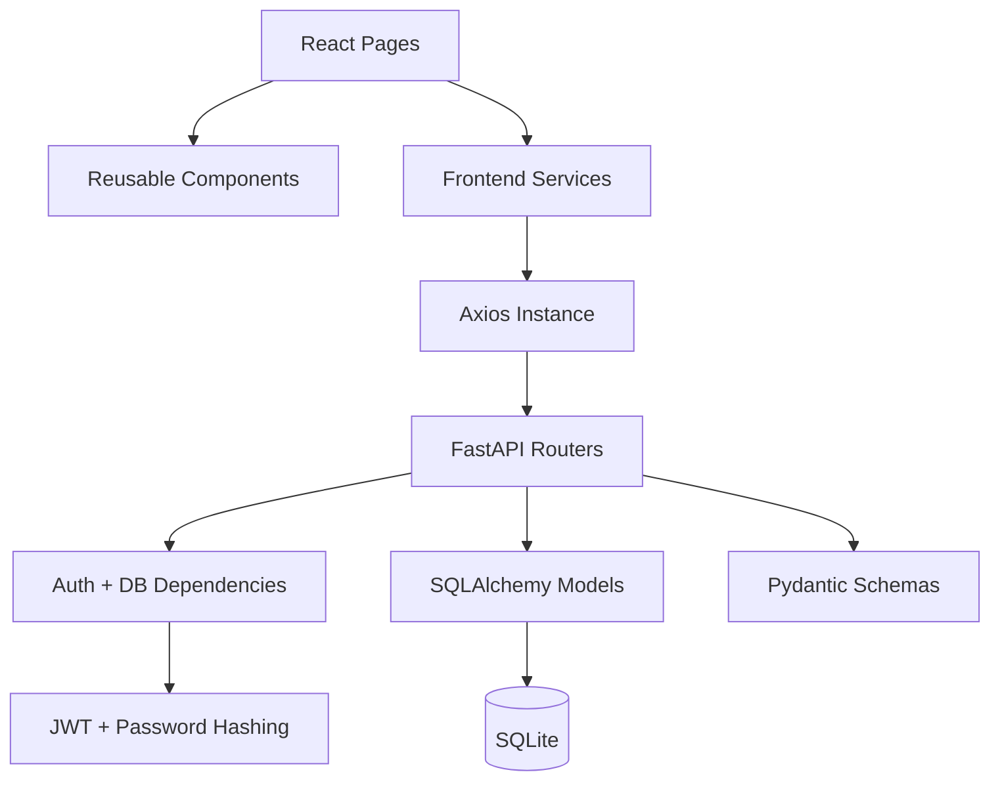

### Сильные стороны

- Простая и понятная структура.
- Backend и frontend разделены физически.
- Есть центральный axios instance.
- Auth вынесен в отдельную frontend-зону.
- API routers разделены по доменам.
- Есть Pydantic schemas для входных данных.
- Канбан-логика использует специализированную библиотеку `@dnd-kit`, а не самописный drag&drop.
- Production build frontend проходит.
- Python-модули компилируются.

### Слабые стороны

- Бизнес-логика смешана с API route handlers.
- Нет миграций, вместо них `ALTER TABLE` на startup.
- Нет response schemas почти для всех endpoint'ов.
- Нет SQLAlchemy relationships, из-за чего появляются ручные lookup'и и N+1 queries.
- Нет тестов.
- Нет role policy abstraction.
- Нет централизованной обработки ошибок.
- Нет типизации frontend.
- Нет data fetching/caching layer.
- Нет production security config.
- SQLite и `.db-shm` отслеживаются git.

### Технический долг

Критический технический долг:

- `password_plain` хранится в БД и возвращается admin/ceo.
- `SECRET_KEY` имеет дефолт `dev-secret-key`.
- `allow_origins=["*"]`.
- Токен хранится в `localStorage`.
- Нет Alembic.
- `requirements.txt` без версий.
- `react-scripts` тянет большое число уязвимых transitive dependencies.

## 5. Frontend анализ

### UI composition

UI построен как dashboard:

- Sticky topbar.
- Sidebar на доске и странице пользователей.
- Kanban columns.
- Task cards.
- Panels/forms.
- Tables.
- Chat messages.

Главные экраны:

| Route | Component | Purpose |
|---|---|---|
| `/login` | `Login.jsx` | Вход |
| `/` | `Board.jsx` | Kanban-доска |
| `/tasks/:id` | `TaskDetails.jsx` | Детали задачи, редактирование, чат |
| `/users` | `Users.jsx` | Пользователи, роли, создание/изменение |

### Routing

Routing находится в `frontend/src/App.js`:

```jsx
<BrowserRouter>
  <Routes>
    <Route path="/login" element={<Login />} />
    <Route path="/" element={<ProtectedRoute><Board /></ProtectedRoute>} />
    <Route path="/tasks/:id" element={<ProtectedRoute><TaskDetails /></ProtectedRoute>} />
    <Route path="/users" element={<ProtectedRoute><Users /></ProtectedRoute>} />
  </Routes>
</BrowserRouter>
```

Недостатки:

- Нет fallback `*` route.
- Для production на static hosting требуется rewrite всех путей на `index.html`.
- Нет route-level lazy loading.

### Компоненты

| Компонент | Тип | Переиспользование | Комментарий |
|---|---|---|---|
| `Board` | Page | Нет | Самый важный экран, много логики внутри |
| `TaskDetails` | Page | Нет | Детали, чат, редактирование, polling |
| `Users` | Page | Нет | Таблица, сортировка, формы управления |
| `Login` | Page | Нет | Простая форма входа |
| `Column` | UI | Да | Droppable column |
| `TaskCard` | UI | Да | Sortable task card |
| `UserMenu` | UI | Да | Dropdown refresh/logout |
| `ProtectedRoute` | Auth shell | Да | Guard для protected pages |

### Бизнес-логика на frontend

Frontend содержит UI-логику и часть бизнес-правил:

- `CREATOR_ROLES = ["admin", "ceo", "manager"]` в `Board.jsx`.
- `canEdit = ["admin", "ceo", "manager"].includes(user?.role)` в `TaskDetails.jsx`.
- `canCreate = ["admin", "ceo"].includes(user?.role)` в `Users.jsx`.
- Фильтрация пространства задач на клиенте.
- Декодирование JWT для роли.

Backend также проверяет роли, поэтому frontend-правила не являются единственной защитой. Это хорошо. Но дублирование ролей в UI и API может привести к рассинхронизации.

### State management

Состояние распределено:

- `AuthProvider`: token/user/isAuth.
- `Board`: tasks/statuses/users/filter/create form.
- `TaskDetails`: task/messages/edit form/status/users/loading/error.
- `Users`: users/sorting/create/update forms.

Плюсы:

- Простота.
- Понятно для небольшого проекта.

Минусы:

- Нет общего кэша.
- Нет автоматической дедупликации запросов.
- Нет stale/retry policies.
- Нет optimistic update.
- Большие page components: `Users.jsx` 367 строк, `Board.jsx` 335 строк, `TaskDetails.jsx` 323 строки.

### Forms и validation

Формы реализованы вручную через controlled inputs.

Валидация frontend:

- Login: нет required validation, ошибка только после API.
- Create task: проверяются `title`, `short_description`, `status_id`.
- Create user: проверяются `username`, `password`.
- Update user: проверяется выбранный пользователь и хотя бы одно поле.
- Message: пустой текст игнорируется.

Backend validation:

- Pydantic проверяет типы.
- Нет `min_length`, `max_length`, regex username, password policy.
- Роли проверяются вручную.

### Responsive system

Адаптивность есть:

- `board__layout` переходит с `230px 1fr` на `1fr` при `max-width: 900px`.
- `users-layout` переходит на одну колонку при `max-width: 960px`.
- `details__grid` переходит на одну колонку при `max-width: 880px`.
- Kanban columns имеют горизонтальный scroll.

Риск: fixed `grid-auto-columns: 300px` хорош для desktop, но на узких экранах приводит к горизонтальному UX, а не native mobile Kanban.

### Animation system

Используется:

- `transition` на hover/focus.
- `@keyframes riseIn` для auth-card.
- `@dnd-kit` drag transformations.

Нет сложной animation architecture, что нормально для dashboard.

### Lazy loading, code splitting

Не реализованы:

- `React.lazy`.
- `Suspense`.
- Route-level code splitting.
- Dynamic imports.

CRA делает single bundle. Текущий gzip JS около 110 KB, это нормально для MVP. При росте страниц стоит разделить routes.

### SSR/CSR/SSG/hydration

Проект является CSR SPA:

- SSR нет.
- SSG нет.
- Hydration server markup нет.
- React монтируется в пустой `<div id="root"></div>`.

### React hooks architecture

Используются:

- `useState`.
- `useEffect`.
- `useMemo`.
- `useRef`.
- `useContext`.

Нет:

- custom hooks для data fetching;
- memoized callbacks через `useCallback`;
- `React.memo`;
- Suspense;
- concurrent features явно.

### Render optimization

Оптимизация минимальная:

- `useMemo` есть для `statusColumns`, `currentUserId`, `filteredTasks`, `sortedItems`.
- `TaskCard`, `Column`, page components не memoized.
- После drag&drop выполняется полный reload задач.

Для текущего объема это приемлемо. При сотнях/тысячах задач будут лишние рендеры и дорогие фильтрации на клиенте.

### Frontend bugs и UX defects

1. В `Users.jsx` форма изменения пользователя почти всегда отправляет `role`, потому что `changeRole` по умолчанию `"employee"`. Если admin хочет изменить только пароль, пользователь может случайно получить роль `employee`.

2. В `TaskDetails.jsx` очистка исполнителя не работает. Frontend отправляет `assignee_id: null`, а backend обновляет исполнителя только если `data.assignee_id is not None`. Backend ожидает специальное значение `0`, но UI его не отправляет.

3. В `TaskDetails.jsx` `editData.status_id` зависит от `statuses`, но задача и statuses загружаются разными эффектами. При первой загрузке `statuses` может быть пустым, поэтому select статуса в форме редактирования останется без текущего значения.

4. `AuthProvider` не проверяет `exp` локально. Истекший токен считается auth до первого API 401.

5. `getMe` в `services/users.js` не используется.

6. `web-vitals`, `yaml`, Testing Library зависимости фактически не дают пользы в runtime.

## 6. Backend анализ

### Endpoint organization

Backend разбит на routers:

| Router | Prefix | Файл |
|---|---|---|
| Auth | `/auth` | `backend/app/api/auth.py` |
| Tasks | `/tasks` | `backend/app/api/tasks.py` |
| Messages | `/tasks/{task_id}/messages` | `backend/app/api/messages.py` |
| Statuses | `/statuses` | `backend/app/api/statuses.py` |
| Users | `/users` | `backend/app/api/users.py` |

### Controllers/services/repositories

Фактических controllers/services/repositories нет. FastAPI route functions выполняют все:

- auth checks;
- role checks;
- SQL queries;
- entity mutation;
- response dict construction.

Пример из `tasks.py`: `get_tasks()` делает `db.query(Task).all()`, затем внутри цикла добирает status, assignee, creator.

### DTO

Request DTO:

- `UserCreate`.
- `UserUpdate`.
- `TaskCreate`.
- `TaskStatusUpdate`.
- `TaskUpdate`.
- `MessageCreate`.

Response DTO почти не используются:

- `Token` используется для login.
- `TaskShort`, `MessageOut` определены, но практически не применяются как `response_model`.
- Большинство endpoint'ов возвращают dict/list вручную.

### Middleware

Middleware один:

```python
app.add_middleware(
    CORSMiddleware,
    allow_origins=["*"],
    allow_credentials=False,
    allow_methods=["*"],
    allow_headers=["*"],
)
```

Это удобно для разработки, но опасно как production default.

### Auth flow

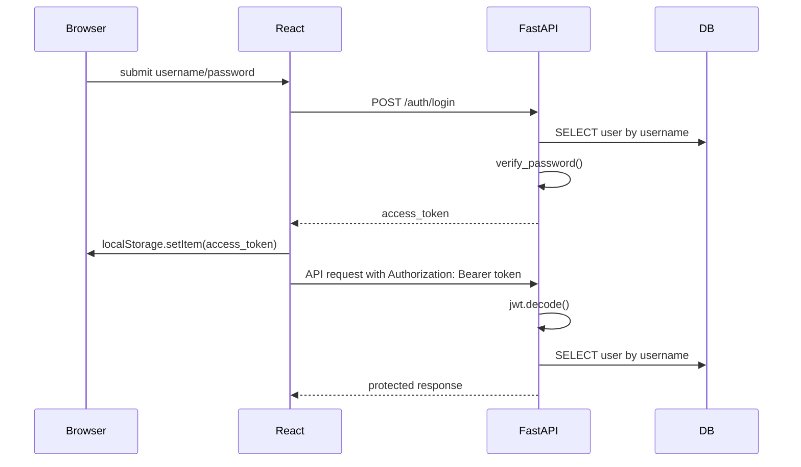

### Session/JWT logic

JWT payload:

```python
token = create_access_token({
    "sub": user.username,
    "role": user.role
})
```

Недостатки:

- Нет `user_id` в токене.
- `sub` основан на username, а username можно изменить.
- После смены роли старый токен продолжит содержать старую роль на frontend до re-login, хотя backend берет текущего пользователя из БД и использует его роль в dependencies/handlers.
- Нет refresh tokens.
- Нет token revocation.

### Database layer

`backend/app/db/session.py`:

```python
DATABASE_URL = "sqlite:///./task_manager.db"
engine = create_engine(DATABASE_URL, connect_args={"check_same_thread": False})
SessionLocal = sessionmaker(autocommit=False, autoflush=False, bind=engine)
```

Недостатки:

- DB URL захардкожен.
- Нет env override.
- Нет connection event для `PRAGMA foreign_keys=ON`.
- Нет миграций.

### Migrations

Миграции отсутствуют. Вместо них startup handlers:

```python
if "assignee_id" not in columns:
    db.execute(text("ALTER TABLE tasks ADD COLUMN assignee_id INTEGER REFERENCES users(id);"))
```

Это допустимо для учебного проекта, но опасно для production:

- Нет истории миграций.
- Нет rollback.
- Нет проверки версий схемы.
- Нет контроля concurrent startup.
- Нет миграций индексов/constraints.

### Caching, websocket, queues, jobs

Не обнаружены:

- Caching layer.
- Redis.
- WebSocket.
- Background jobs.
- Queues.
- Scheduler.

Чат реализован polling на frontend каждые 5 секунд.

### Request lifecycle

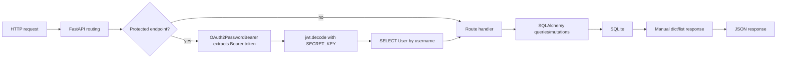

## 7. API анализ

API - REST-like JSON API. GraphQL/RPC нет. Versioning нет (`/v1` отсутствует). Error handling стандартный FastAPI через `HTTPException`.

### Request/response characteristics

| Аспект | Состояние |
|---|---|
| Protocol | HTTP JSON |
| Auth | Bearer JWT |
| Versioning | Нет |
| Response schemas | Частично, в основном отсутствуют |
| Error schema | Стандартный FastAPI `{detail: ...}` |
| API clients | `frontend/src/services/*.js` |
| Fetch wrapper | Axios instance `api.js` |
| CORS | Открытый `*` |

### API table

| METHOD | ENDPOINT | PURPOSE | USED IN |
|---|---|---|---|
| GET | `/` | Healthcheck `{status: "ok"}` | Не используется frontend |
| POST | `/auth/login` | Логин, выдача JWT | `Login.jsx` |
| POST | `/auth/register` | Создать пользователя, admin/ceo only | `Users.jsx` via `registerUser` |
| GET | `/users/` | Список пользователей | `Board.jsx`, `Users.jsx` |
| GET | `/users/me` | Текущий пользователь | `services/users.js`, фактически не используется |
| PATCH | `/users/{user_id}` | Изменить username/role/password | `Users.jsx` |
| GET | `/statuses/` | Список статусов | `Board.jsx`, `TaskDetails.jsx` |
| GET | `/tasks/` | Список видимых задач | `Board.jsx` |
| POST | `/tasks/` | Создать задачу | `Board.jsx` |
| GET | `/tasks/{task_id}` | Детали задачи | `TaskDetails.jsx` |
| PATCH | `/tasks/{task_id}/status` | Сменить статус по имени | `Board.jsx` drag&drop |
| PATCH | `/tasks/{task_id}` | Изменить задачу | `TaskDetails.jsx` |
| GET | `/tasks/{task_id}/messages/` | Получить сообщения задачи | `TaskDetails.jsx`, polling |
| POST | `/tasks/{task_id}/messages/` | Добавить сообщение | `TaskDetails.jsx` |

### API risks

- Нет rate limiting на login.
- Нет lockout/bruteforce protection.
- Нет pagination для users/tasks/messages.
- `GET /tasks/` всегда читает все задачи из БД.
- `GET /users/` возвращает пароли admin/ceo.
- `PATCH /tasks/{id}/status` разрешает смену статуса всем, кто видит задачу. Это может быть бизнес-правилом, но для enterprise обычно нужна отдельная permission.
- Нет API versioning.

## 8. Анализ базы данных

### Schema

Фактическая SQLite schema:

```sql
CREATE TABLE users (
  id INTEGER NOT NULL,
  username VARCHAR NOT NULL,
  password_hash VARCHAR NOT NULL,
  password_plain VARCHAR,
  role VARCHAR NOT NULL,
  created_at DATETIME DEFAULT CURRENT_TIMESTAMP,
  PRIMARY KEY (id)
);

CREATE TABLE statuses (
  id INTEGER NOT NULL,
  name VARCHAR NOT NULL,
  order_index INTEGER NOT NULL,
  PRIMARY KEY (id),
  UNIQUE (name)
);

CREATE TABLE tasks (
  id INTEGER NOT NULL,
  title VARCHAR NOT NULL,
  short_description VARCHAR NOT NULL,
  description TEXT,
  status_id INTEGER NOT NULL,
  created_by INTEGER NOT NULL,
  assignee_id INTEGER,
  created_at DATETIME DEFAULT CURRENT_TIMESTAMP,
  updated_at DATETIME DEFAULT CURRENT_TIMESTAMP,
  PRIMARY KEY (id),
  FOREIGN KEY(status_id) REFERENCES statuses (id),
  FOREIGN KEY(created_by) REFERENCES users (id),
  FOREIGN KEY(assignee_id) REFERENCES users (id)
);

CREATE TABLE messages (
  id INTEGER NOT NULL,
  content TEXT NOT NULL,
  task_id INTEGER NOT NULL,
  user_id INTEGER NOT NULL,
  created_at DATETIME DEFAULT CURRENT_TIMESTAMP,
  PRIMARY KEY (id),
  FOREIGN KEY(task_id) REFERENCES tasks (id),
  FOREIGN KEY(user_id) REFERENCES users (id)
);
```

### Relationships

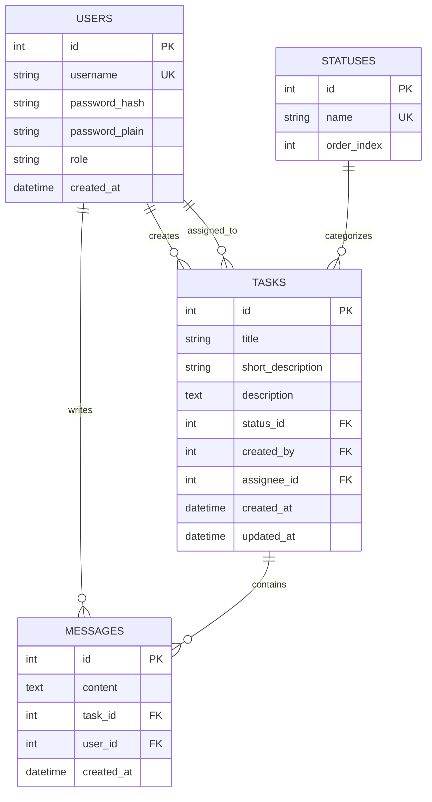

### Central entities

1. `tasks` - центральная бизнес-сущность.
2. `users` - идентичность, роли, исполнители.
3. `statuses` - workflow board columns.
4. `messages` - обсуждения задач.

### Indexes

Фактически есть:

- `ix_users_id`
- `ix_users_username` unique
- `ix_tasks_id`
- `ix_statuses_id`
- `ix_messages_id`
- autoindex на `statuses.name`

Нет индексов:

- `tasks.status_id`
- `tasks.assignee_id`
- `tasks.created_by`
- `messages.task_id`
- `messages.user_id`
- `messages.created_at`

Для текущих 24 задач/341 сообщений это не критично. Для роста это станет bottleneck.

### Normalization

Нормализация частичная:

- Статусы вынесены в отдельную таблицу.
- Пользователи вынесены в отдельную таблицу.
- Сообщения вынесены отдельно.

Нарушение безопасности/нормализации:

- `password_plain` не должен существовать в production БД.
- `role` строкой без enum/constraint.
- Нет таблицы audit log.
- Нет статусов как workspace/project-specific сущностей.

### Data flow

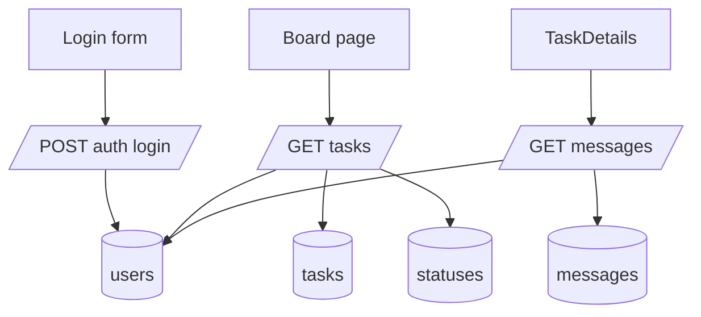

## 9. UI/UX система

### Design system

Есть локальная дизайн-система в CSS variables:

- Dark palette.
- Accent colors: cyan/purple/green/yellow/red.
- Radii: `--radius: 18px`, `--radius2: 14px`.
- Shadows: `--shadow`, `--shadow2`.
- Typography: IBM Plex Sans/Mono.
- Components: buttons, inputs, textarea, topbar, sidebar, panels, tables, cards, messages.

### Colors

Основная палитра темная, с glassmorphism-панелями и cyan/purple accents. Визуально консистентно, но production dashboard обычно выигрывает от более спокойной, менее декоративной палитры.

### Typography

Используется IBM Plex Sans/Mono через Google Fonts:

```html
<link
  href="https://fonts.googleapis.com/css2?family=IBM+Plex+Sans:wght@400;500;600;700&family=IBM+Plex+Mono:wght@400;600&display=swap"
  rel="stylesheet"
/>
```

Риск: внешний запрос к Google Fonts. Для production в закрытых корпоративных системах лучше self-host fonts.

### Spacing

Spacing задан вручную через `padding`, `gap`, `margin`. Нет token scale (`--space-1`, `--space-2`, etc). Консистентность держится за счет одного CSS-файла, но с ростом проекта будет сложнее.

### Themes/dark mode

Только dark theme. Light theme/dark toggle нет.

### Adaptive behavior

Адаптивность базовая, достаточная для учебного dashboard. На mobile Kanban остается горизонтально скроллящимся, что приемлемо, но не идеально.

### Accessibility

Плюсы:

- Есть `aria-label` на drag handle.
- Есть focus-visible styling.
- Формы используют `autoComplete`.

Минусы:

- Labels реализованы как `<div className="label">`, а не `<label htmlFor>`.
- Нет `aria-live` для ошибок.
- Dropdown menu не имеет keyboard navigation semantics.
- Drag&drop accessibility полностью зависит от `@dnd-kit`, но custom UX не доработан.
- Контраст нужно отдельно проверять автоматическими инструментами.

### UX patterns

Хорошие решения:

- Верхняя панель единая на основных экранах.
- `UserMenu` объединяет refresh/logout.
- Форма создания задачи свернута.
- Чужие видимые задачи подсвечены.
- Users table sortable.

Проблемы UX:

- На странице Users sidebar пункты "Роли" и "Журнал действий" выглядят кликабельными, но ничего не делают.
- Отображение plaintext-пароля в UI опасно и создает неверный UX-паттерн.
- Нет подтверждения опасных изменений ролей/паролей.
- Нет optimistic feedback при drag&drop кроме последующего reload.

### Production-ready UI оценка

UI консистентен для MVP, но не production-ready для enterprise:

- нет accessibility-проверок;
- нет component library/storybook;
- нет i18n;
- нет empty/error/loading states во всех местах на одном уровне качества;
- нет toast/notification system;
- нет подтверждений рискованных действий.

## 10. Performance анализ

### Текущие показатели

`npm run build`:

| Bundle | Gzip size |
|---|---:|
| JS | ~110.25 KB |
| CSS | ~3 KB |

Это хороший размер для текущего MVP.

### Bottlenecks

1. `GET /tasks/` читает все задачи:

```python
tasks = db.query(Task).all()
```

Фильтрация видимости происходит в Python. При росте задач это станет bottleneck.

2. N+1 queries в `get_tasks()`:

```python
status_name = db.query(Status).get(t.status_id).name
assignee = db.query(User).get(t.assignee_id) if t.assignee_id else None
creator = db.query(User).get(t.created_by) if t.created_by else None
```

На каждую задачу идут дополнительные запросы.

3. N+1 queries в `get_messages()`:

```python
"user": db.query(User).get(m.user_id).username
```

4. Нет pagination для messages. Чат при каждой загрузке получает весь список сообщений.

5. Polling чата каждые 5 секунд:

```jsx
const interval = setInterval(async () => {
  const m = await getTaskMessages(taskId);
  setMessages(m);
}, 5000);
```

Для нескольких пользователей и большого числа задач это неэффективно.

6. Frontend reload after drag:

```jsx
await updateTaskStatus(taskId, newStatus);
loadTasks();
```

Нет optimistic update, каждый drag делает полный список задач.

7. Нет code splitting. Сейчас bundle мал, но с ростом страниц и библиотек станет проблемой.

### Memory leaks

Явных утечек не найдено. `TaskDetails` очищает interval через `clearInterval`, `UserMenu` снимает document listener.

### Hydration issues

SSR/hydration нет.

### Unnecessary dependencies

Потенциально лишние:

- `yaml`: не найдено использование в `src`; установленная версия конфликтует с `package.json`.
- `web-vitals`: не используется.
- Testing Library packages: нужны только при добавлении тестов, сейчас тестов нет.

### Оптимизации

Срочно:

- Переписать `GET /tasks/` на SQL-level фильтрацию и joins.
- Добавить indexes на FK.
- Добавить pagination для messages/users/tasks.
- Убрать N+1 через relationships + `joinedload/selectinload`.

Среднесрочно:

- React Query/TanStack Query для кэша, retries, invalidation.
- Optimistic update для drag&drop.
- WebSocket или SSE для чата вместо polling.
- Route-level lazy loading.

## 11. Безопасность

### Критические проблемы

| Риск | Где | Почему опасно | Приоритет |
|---|---|---|---|
| Plaintext passwords | `users.password_plain`, `auth.py`, `users.py` | Компрометация БД/API раскрывает пароли | Critical |
| Passwords returned by API | `GET /users/` для admin/ceo | Утечка через UI, logs, browser, screenshots | Critical |
| Default JWT secret | `config.py` | Любой, кто знает дефолт, может подписать токен | Critical |
| Open CORS | `main.py` | Любой origin может дергать API | High |
| JWT in localStorage | `AuthProvider`, `api.js` | XSS приводит к краже токена | High |
| No rate limit login | `/auth/login` | Brute force | High |
| No password policy | schemas/auth | Слабые пароли | Medium |
| No migrations/secrets separation | config/session | Ошибки prod-конфигурации | Medium |

### Secrets

`SECRET_KEY`:

```python
SECRET_KEY = os.getenv("SECRET_KEY", "dev-secret-key")
```

Для production это недопустимо. Приложение должно падать при отсутствии `SECRET_KEY` в production.

### Env variables

`.env` в `.gitignore`, но:

- `DATABASE_URL` не берется из env.
- `SECRET_KEY` берется, но имеет небезопасный default.
- `ACCESS_TOKEN_EXPIRE_MINUTES` захардкожен.
- CORS origins не конфигурируются через env.

### Auth безопасность

Проблемы:

- Нет refresh/revoke.
- Нет `aud`, `iss`, `jti`.
- Нет server-side session invalidation.
- Username в `sub` может меняться.
- Frontend доверяет decoded role для UI, хотя backend проверяет свою роль. Это нормально для UX, но нельзя использовать как security boundary.

### XSS

React экранирует текст по умолчанию. В коде нет `dangerouslySetInnerHTML`. Однако из-за `localStorage` любой XSS будет критичен.

### CSRF

Токен передается в Authorization header, cookies не используются. Классический CSRF ниже по риску. Но open CORS и localStorage создают другие угрозы.

### SQL Injection

Большинство запросов через SQLAlchemy ORM. Ручной SQL есть только для `PRAGMA`/`ALTER TABLE` без user input. SQL injection риск низкий.

### Public keys/tokens

Публичных API ключей не найдено.

### Middleware protection

Нет security headers:

- HSTS.
- CSP.
- X-Frame-Options / frame-ancestors.
- X-Content-Type-Options.
- Referrer-Policy.

Это обычно решается через reverse proxy или middleware.

## 12. DevOps и инфраструктура

### Как запускается проект

Основной способ:

```bash
python run_all.py --mode dev
```

Backend:

```bash
cd backend
uvicorn app.main:app --reload
```

Frontend:

```bash
cd frontend
npm start
```

Preview:

```bash
python run_all.py --mode preview --frontend-port 3000
```

### Env setup

Текущий setup:

```bash
python -m venv backend/.venv
backend/.venv/Scripts/Activate.ps1
pip install -r backend/requirements.txt

cd frontend
npm ci
```

Проблемы:

- Python dependencies unpinned.
- Нет `.env.example`.
- Нет production env documentation.
- Нет separate config profiles.

### Build pipeline

Есть только локальная сборка:

```bash
cd frontend
npm run build
```

На момент аудита сборка успешна.

### Deployment flow

Production deployment flow не описан и не автоматизирован. В README есть preview через `npx serve`, но это не production-grade.

### Docker/nginx/CI/CD/cloud

Не обнаружено:

- Docker.
- Nginx.
- GitHub Actions.
- Cloud deployment config.
- Reverse proxy.
- Domain config.

### Git/worktree observations

На момент аудита:

```text
M  backend/task_manager.db
D  start.sh
```

Также `backend/task_manager.db` и `backend/task_manager.db-shm` отслеживаются git. Для production и командной разработки БД-файлы должны быть исключены из git, а состояние воспроизводиться миграциями/seed scripts.

## 13. Зависимости

### Frontend dependencies

`npm ls --depth=0` показал установленные direct dependencies:

| Package | Installed | Role |
|---|---:|---|
| `react` | 19.2.4 | UI |
| `react-dom` | 19.2.4 | DOM render |
| `react-router-dom` | 7.13.0 | Routing |
| `axios` | 1.13.5 | HTTP client |
| `@dnd-kit/core` | 6.3.1 | Drag&drop |
| `@dnd-kit/sortable` | 10.0.0 | Sortable cards |
| `@dnd-kit/utilities` | 3.2.2 | DnD utilities |
| `react-scripts` | 5.0.1 | CRA build |
| `@testing-library/*` | various | Test stack, unused |
| `web-vitals` | 2.1.4 | CRA default, unused |
| `yaml` | installed 1.10.2 | Declared `^2.8.2`, invalid install |

### Frontend dependency issues

`npm ls` завершился с ошибкой:

```text
yaml@1.10.2 invalid: "^2.8.2" from the root project
```

Это означает рассинхронизацию `node_modules` с `package.json`/lock или поврежденное install-состояние. `npm ci` должен восстановить консистентность.

`npm outdated --json` показал:

| Package | Current | Wanted/latest | Комментарий |
|---|---:|---:|---|
| `axios` | 1.13.5 | 1.16.1 | Нужно обновить, есть audit issues |
| `react` | 19.2.4 | 19.2.6 | Patch update |
| `react-dom` | 19.2.4 | 19.2.6 | Patch update |
| `react-router-dom` | 7.13.0 | 7.15.1 | Minor update |
| `yaml` | 1.10.2 | 2.9.0 | Конфликт и security issue |
| `web-vitals` | 2.1.4 | 5.2.0 | Unused или upgrade |
| `@testing-library/user-event` | 13.5.0 | 14.6.1 | Only if tests used |

`npm audit`:

| Severity | Count |
|---|---:|
| Critical | 0 |
| High | 22 |
| Moderate | 12 |
| Low | 10 |
| Total | 44 |

Прямые уязвимые/проблемные direct dependencies:

- `axios` - high via advisories in installed range.
- `react-scripts` - high because of transitive dependencies.
- `yaml` - moderate and invalid installed version.

Большая часть audit noise идет через `react-scripts 5.0.1` и его старую цепочку Webpack/Jest/Workbox/SVGO.

### Backend dependencies

`pip freeze` показал ключевые версии:

| Package | Installed | Role |
|---|---:|---|
| `fastapi` | 0.128.4 | API framework |
| `uvicorn` | 0.40.0 | ASGI server |
| `SQLAlchemy` | 2.0.46 | ORM |
| `pydantic` | 2.12.5 | Validation |
| `python-jose` | 3.5.0 | JWT |
| `passlib` | 1.7.4 | Password hashing |
| `bcrypt` | 5.0.0 | Installed but not used as scheme |
| `cryptography` | 46.0.5 | Crypto dependency |
| `python-dotenv` | 1.2.1 | Env support |

`pip check`:

```text
No broken requirements found.
```

`pip list --outdated` показал устаревшие пакеты, среди них:

| Package | Current | Latest |
|---|---:|---:|
| `fastapi` | 0.128.4 | 0.136.1 |
| `uvicorn` | 0.40.0 | 0.47.0 |
| `SQLAlchemy` | 2.0.46 | 2.0.49 |
| `pydantic` | 2.12.5 | 2.13.4 |
| `cryptography` | 46.0.5 | 48.0.0 |
| `starlette` | 0.52.1 | 1.0.1 |

### Backend dependency issues

- `requirements.txt` не закрепляет версии:

```text
fastapi
uvicorn
sqlalchemy
pydantic
python-jose[cryptography]
passlib[bcrypt]
python-dotenv
```

Это делает установки невоспроизводимыми. Нужно закрепить версии или использовать `pip-tools`/Poetry/uv.

## 14. Качество кода

### Readability

Код читаемый, файлы названы понятно, domain intent ясен. Для учебного проекта структура адекватна.

### Consistency

Плюсы:

- API routers оформлены единообразно.
- Frontend services отделены от pages.
- CSS naming в стиле BEM-like (`topbar__inner`, `user-menu__btn`).

Минусы:

- Response format разный: где-то `{status: "ok"}`, где-то `{"id": task.id}`, где-то list dict.
- Нет единого error handling на frontend.
- В backend часть schemas не используется.
- Русские комментарии и UI-строки нормальны для проекта, но стоит унифицировать encoding/tooling.

### Naming

Нейминг понятный:

- `Task`, `Status`, `Message`, `User`.
- `TaskCreate`, `TaskUpdate`.
- `getTasks`, `createTask`, `updateTask`.

Проблема: `canCreate` в `Users.jsx` фактически означает can manage users, не только create.

### Abstraction quality

Абстракции достаточны для MVP, но недостаточны для роста:

- Нет `taskService`.
- Нет `userService` на backend.
- Нет policy layer.
- Нет repository layer.
- Нет shared frontend form components.
- CSS один большой файл на 716 строк.

### Duplicate code

Повторяется:

- Topbar/UserMenu layout в `Board`, `TaskDetails`, `Users`.
- Form field markup.
- Error handling.
- Role arrays на frontend и role checks на backend.
- Manual user/status lookups в API.

### Maintainability

Оценка maintainability: средняя для MVP, низкая для production. Основная причина - большие page components и backend route handlers с бизнес-логикой.

### Anti-patterns

| Anti-pattern | Где | Почему плохо |
|---|---|---|
| Plaintext password storage | `User.password_plain` | Critical security flaw |
| Fat route handlers | `tasks.py`, `users.py` | Плохо тестировать и расширять |
| Manual migrations on startup | `main.py` | Ненадежно |
| Global open CORS | `main.py` | Небезопасно |
| DB files in git | `backend/task_manager.db` | Конфликты/утечки |
| N+1 queries | `tasks.py`, `messages.py` | Performance degradation |
| Frontend pages as god components | `Board`, `Users`, `TaskDetails` | Сложно сопровождать |

## 15. Точки улучшения

### Срочно

1. Удалить `password_plain` из модели, API, UI и БД.
2. Пересоздать/мигрировать пароли только в hash.
3. Перейти на `bcrypt` или `argon2`, а не `sha256_crypt`.
4. Убрать default `SECRET_KEY`; требовать env var.
5. Ограничить CORS конкретными origins.
6. Убрать SQLite DB files из git, добавить их в `.gitignore`.
7. Добавить Alembic migrations.
8. Закрепить версии backend dependencies.
9. Исправить `yaml` dependency conflict.
10. Обновить `axios`.
11. Решить судьбу CRA: миграция на Vite или другой современный build stack.
12. Добавить базовые backend tests на auth/access/task visibility.

### Потом

1. Вынести backend business logic в services.
2. Вынести access policy в отдельный модуль.
3. Добавить repositories или query layer.
4. Добавить response models.
5. Добавить pagination/filtering/sorting на backend.
6. Добавить SQLAlchemy relationships и eager loading.
7. Добавить React Query.
8. Разбить большие page components.
9. Добавить reusable form controls.
10. Добавить Storybook или хотя бы component examples.
11. Добавить Playwright smoke tests.
12. Добавить Docker Compose.

### Что мешает масштабированию

- SQLite как единственная БД.
- Нет миграций.
- Нет indexes на FK.
- Нет backend filtering.
- Нет pagination.
- Нет cache/data fetching layer.
- Нет CI.
- Нет tests.
- Нет production config.
- Fat components и fat API handlers.

### Что может сломаться при росте

- `GET /tasks/` будет медленным.
- `GET /messages/` будет тянуть слишком много сообщений.
- Users table без pagination станет тяжелой.
- Polling чатов создаст лишнюю нагрузку.
- DB file conflicts в git.
- Role logic будет расходиться между frontend/backend.
- Startup `ALTER TABLE` станет опасным при нескольких инстансах.

### Что переписать

- Auth/password subsystem.
- User management API/UI, чтобы не показывать пароли.
- Task query layer.
- Migration strategy.
- Frontend data fetching.
- Build tooling после закрытия текущих задач.

### Что оставить

- Общую domain model: users/tasks/statuses/messages.
- Разделение frontend/backend.
- FastAPI как backend framework.
- React как frontend framework.
- `@dnd-kit` для Kanban.
- `run_all.py` как dev convenience script.

## 16. Итоговая оценка проекта

| Категория | Оценка | Комментарий |
|---|---:|---|
| Техническая реализация | 6/10 | MVP работает, но есть security/performance долги |
| Архитектура | 5/10 | Понятная, но без service/repository/migrations |
| UX | 6/10 | Консистентный dashboard, но есть UX-дефекты и опасные паттерны |
| Scalability | 3/10 | Нет pagination, indexes, cache, migrations, production DB |
| Production readiness | 2/10 | Нельзя выпускать из-за password/security/dev config |
| Maintainability | 5/10 | Нормально для курсовой, плохо для роста |

## 17. Визуализация архитектуры

### Dependency graph

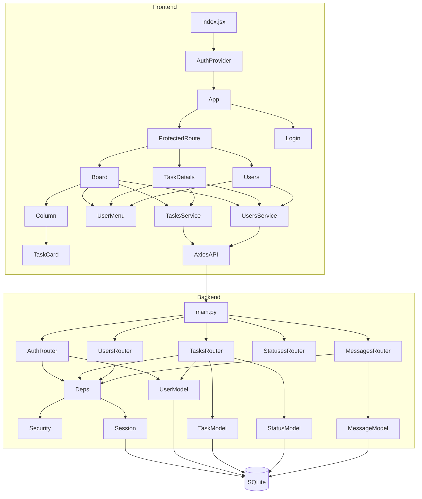

### Module graph

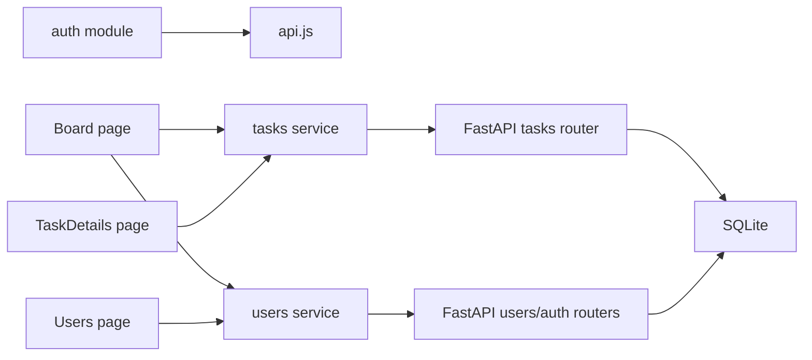

### Component hierarchy

```text
index.jsx
└── AuthProvider
    └── App
        └── BrowserRouter
            ├── /login -> Login
            ├── / -> ProtectedRoute
            │   └── Board
            │       ├── UserMenu
            │       ├── Sidebar
            │       ├── CreateTaskForm
            │       └── DndContext
            │           └── Column
            │               └── TaskCard
            ├── /tasks/:id -> ProtectedRoute
            │   └── TaskDetails
            │       ├── UserMenu
            │       ├── TaskInfoPanel
            │       ├── EditTaskForm
            │       └── MessagesPanel
            └── /users -> ProtectedRoute
                └── Users
                    ├── UserMenu
                    ├── Sidebar
                    ├── CreateUserForm
                    ├── UpdateUserForm
                    └── UsersTable
```

### Data flow diagrams

#### Board load

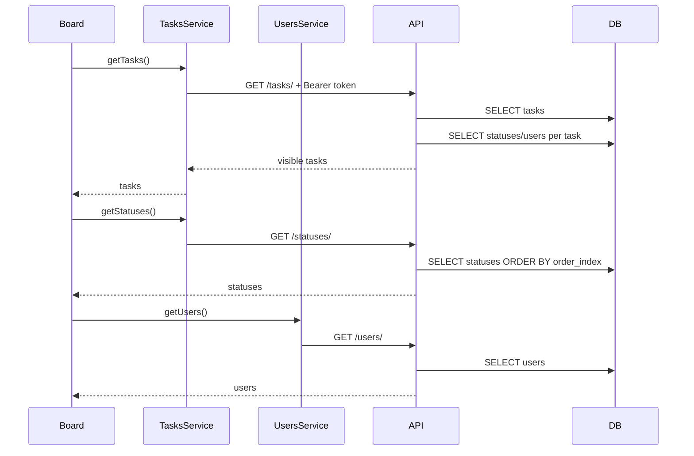

#### Drag status change

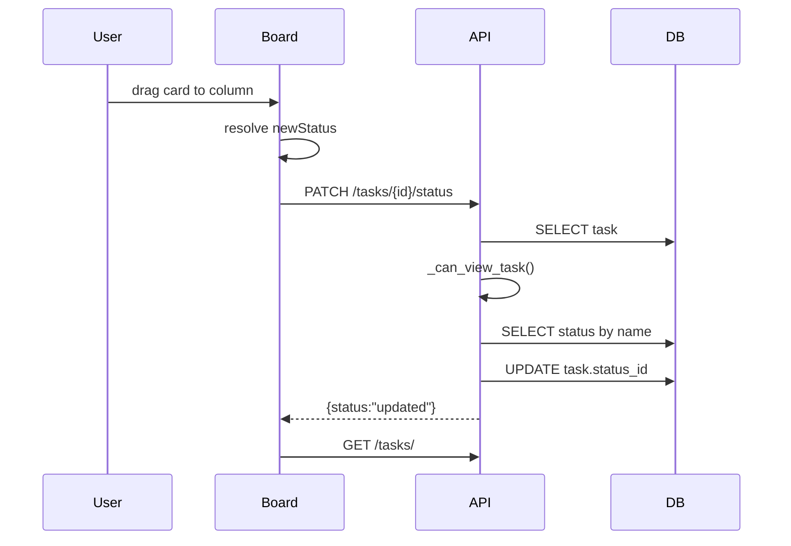

#### Chat polling

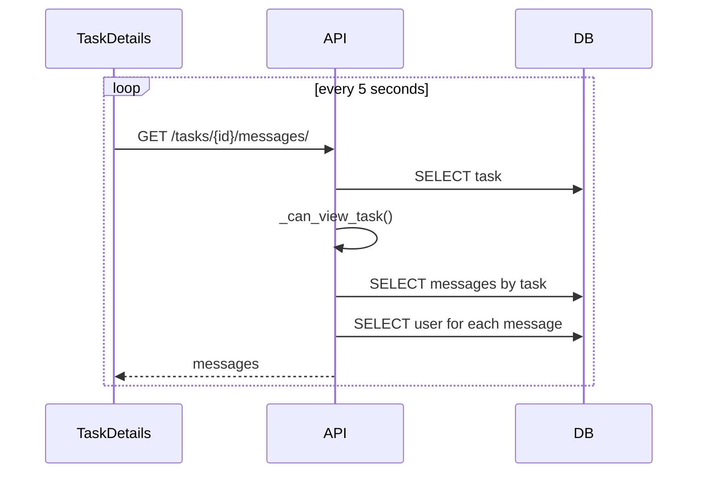

### State flow

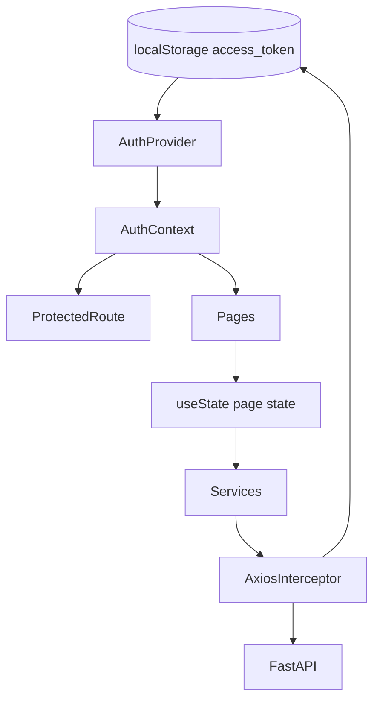

## 18. Важные файлы

| Файл | Почему важен |
|---|---|
| `run_all.py` | Dev orchestration frontend+backend |
| `backend/app/main.py` | FastAPI app, CORS, routers, schema create, startup mutations |
| `backend/app/api/deps.py` | DB session dependency, current user extraction |
| `backend/app/api/auth.py` | Login/register |
| `backend/app/api/tasks.py` | Главная бизнес-логика задач и access policy |
| `backend/app/api/users.py` | User management, чувствительный вывод паролей |
| `backend/app/api/messages.py` | Chat API |
| `backend/app/core/config.py` | `SECRET_KEY`, JWT settings |
| `backend/app/core/security.py` | Password hashing, JWT signing |
| `backend/app/db/session.py` | SQLite connection |
| `backend/app/models/*.py` | Data model |
| `backend/app/schemas/*.py` | Request DTO |
| `backend/seed_demo.py` | Reset/seed demo data |
| `frontend/src/index.jsx` | React entrypoint |
| `frontend/src/App.js` | Frontend routing |
| `frontend/src/auth/AuthProvider.jsx` | Auth state and token decode |
| `frontend/src/auth/ProtectedRoute.jsx` | Route guard |
| `frontend/src/services/api.js` | Axios base URL, auth interceptor, 401 behavior |
| `frontend/src/pages/Board.jsx` | Kanban board and create task |
| `frontend/src/pages/TaskDetails.jsx` | Task details, edit, chat |
| `frontend/src/pages/Users.jsx` | User management |
| `frontend/src/index.css` | UI system |
| `frontend/package.json` | Frontend dependencies/scripts |
| `backend/requirements.txt` | Backend dependencies |

## 19. Пошаговый onboarding

### 1. Подготовить backend

```powershell
python -m venv backend/.venv
backend/.venv/Scripts/Activate.ps1
pip install -r backend/requirements.txt
```

### 2. Подготовить frontend

```powershell
cd frontend
npm ci
cd ..
```

Если `npm ls` показывает конфликт `yaml`, выполнить чистую переустановку:

```powershell
cd frontend
Remove-Item -Recurse -Force node_modules
npm ci
cd ..
```

### 3. Запустить все вместе

```powershell
python run_all.py --mode dev
```

Ожидаемые адреса:

- Backend: `http://localhost:8000`
- Frontend: `http://localhost:3000`
- FastAPI docs: `http://localhost:8000/docs`

### 4. Запустить по отдельности

Backend:

```powershell
cd backend
..\.venv\Scripts\python.exe -m uvicorn app.main:app --reload
```

Frontend:

```powershell
cd frontend
npm start
```

### 5. Наполнить демо-данными

```powershell
cd backend
python seed_demo.py
```

Демо-логины из README:

| Username | Password | Role |
|---|---|---|
| `admin` | `admin123` | admin |
| `ceo` | `ceo123` | ceo |
| `manager` | `manager123` | manager |
| `employee1` | `emp001` или по seed-логике | employee |

Фактический seed сейчас создает `employee1`..`employee20` с паролями `emp001`..`emp020`.

### 6. Где менять UI

| Задача | Файл |
|---|---|
| Маршруты | `frontend/src/App.js` |
| Kanban board | `frontend/src/pages/Board.jsx` |
| Карточка задачи | `frontend/src/components/TaskCard.jsx` |
| Колонка | `frontend/src/components/Column.jsx` |
| Детали/чат | `frontend/src/pages/TaskDetails.jsx` |
| Пользователи | `frontend/src/pages/Users.jsx` |
| Общие стили | `frontend/src/index.css` |
| API calls | `frontend/src/services/*.js` |

### 7. Где менять backend

| Задача | Файл |
|---|---|
| Новый endpoint задач | `backend/app/api/tasks.py` |
| Auth/register/login | `backend/app/api/auth.py` |
| Проверка current user | `backend/app/api/deps.py` |
| Пользователи | `backend/app/api/users.py` |
| Сообщения | `backend/app/api/messages.py` |
| Модель БД | `backend/app/models/*.py` |
| Request schema | `backend/app/schemas/*.py` |
| JWT/password | `backend/app/core/security.py` |
| Конфиг | `backend/app/core/config.py` |

### 8. Как добавить страницу

1. Создать `frontend/src/pages/NewPage.jsx`.
2. Добавить route в `frontend/src/App.js`.
3. При необходимости обернуть в `ProtectedRoute`.
4. Добавить ссылку/кнопку навигации в нужную topbar/sidebar.
5. Добавить стили в `index.css` или выделить CSS-модуль при рефакторинге.

### 9. Как добавить API endpoint

1. Добавить Pydantic schema в `backend/app/schemas`.
2. Добавить route в подходящий router или новый `backend/app/api/<domain>.py`.
3. Подключить router в `backend/app/main.py`, если новый.
4. Добавить frontend service method в `frontend/src/services`.
5. Использовать service в page/component.
6. Добавить тесты.

### 10. Как деплоить сейчас

Текущий production deployment формально не готов. Минимальный preview:

```powershell
python run_all.py --mode preview --frontend-port 3000
```

Для реального deploy нужно сначала выполнить roadmap из разделов security/devops.

## 20. Финальный вывод

Проект хорошо подходит как курсовая работа и демонстрация связки FastAPI + React + JWT + Kanban. Видно, что реализованы реальные пользовательские сценарии: вход, доска, роли, задачи, исполнители, чат, управление пользователями.

Уровень проекта: учебный MVP / working prototype.  
Уровень разработки: junior+/middle учебный fullstack с отдельными сильными решениями, но без production engineering слоя.  
Коммерческая готовность: низкая.  
Production readiness: низкая из-за security и infrastructure gaps.  
Архитектура: понятная и расширяемая в малом масштабе, но требует выделения слоев и миграций.

Главные плюсы:

- Реальный end-to-end функционал.
- Понятная структура.
- Ролевая бизнес-логика есть на backend.
- Kanban drag&drop на готовой библиотеке.
- Frontend build проходит.
- Backend компилируется.

Главные минусы:

- Plaintext-пароли.
- Небезопасные defaults.
- Нет миграций.
- Нет тестов.
- Нет production DevOps.
- Невоспроизводимые backend dependencies.
- Уязвимости/устаревшая frontend dependency chain.
- Fat route handlers и fat page components.

## Technical Audit

### Проверенные команды

| Команда | Результат |
|---|---|
| `rg --files` с исключениями | Карта проекта собрана |
| `python -m compileall backend\app backend\seed_demo.py run_all.py` | Успешно |
| `npm run build` | Успешно |
| `backend\.venv\Scripts\python.exe -m pip check` | No broken requirements found |
| `npm ls --depth=0` | Ошибка из-за `yaml@1.10.2 invalid` |
| `npm outdated --json` | Есть устаревшие frontend deps |
| `npm audit --json` | 44 vulnerabilities |
| SQLite introspection | Схема и counts получены |

### Ключевые findings

| Severity | Finding |
|---|---|
| Critical | Plaintext passwords stored and returned |
| Critical | Default JWT secret |
| High | Open CORS |
| High | JWT in localStorage |
| High | No migrations |
| High | DB files tracked in git |
| High | `react-scripts` vulnerable transitive chain |
| Medium | N+1 backend queries |
| Medium | No pagination |
| Medium | No tests |
| Medium | No Docker/CI/CD |
| Medium | Frontend form bugs in role update/task assignee clearing |

## Architecture Report

Текущая архитектура - simple fullstack monolith with separated frontend/backend. Для текущего размера это рационально. Основной следующий шаг - не микросервисы, а дисциплина внутри монолита:

```text
backend/app/
  api/          # only HTTP concerns
  services/     # business use cases
  repositories/ # SQLAlchemy queries
  policies/     # role/access decisions
  models/       # ORM
  schemas/      # request/response DTO
  core/         # config/security
```

Frontend стоит развивать в сторону feature modules:

```text
frontend/src/
  app/
  shared/
  features/
    auth/
    tasks/
    users/
    messages/
  pages/
```

Не нужно преждевременно делать microservices. Сначала нужно укрепить модульный монолит.

## Refactoring Roadmap

### Этап 1. Security hardening

- Удалить `password_plain`.
- Скрыть пароли из `/users/`.
- Заменить hashing scheme на bcrypt/argon2.
- Потребовать `SECRET_KEY` из env.
- Ограничить CORS.
- Добавить `.env.example`.
- Добавить rate limit login.

### Этап 2. Database hygiene

- Убрать `task_manager.db*` из git.
- Добавить Alembic.
- Добавить индексы на FK.
- Включить SQLite foreign keys или перейти на PostgreSQL.
- Добавить seed только как dev tool.

### Этап 3. Backend architecture

- Вынести `_can_view_task` в `policies/tasks.py`.
- Добавить `TaskService`, `UserService`, `MessageService`.
- Добавить response models.
- Убрать N+1 через relationships/eager loading.
- Добавить pagination.

### Этап 4. Frontend architecture

- Исправить bugs в forms.
- Вынести common layout/topbar.
- Вынести forms в компоненты.
- Добавить React Query.
- Добавить route-level lazy loading.
- Добавить toast/error system.

### Этап 5. Quality gate

- Pytest для backend.
- React Testing Library для critical UI.
- Playwright smoke tests.
- ESLint/Prettier config.
- CI pipeline.

### Этап 6. Production deployment

- Dockerfile backend.
- Dockerfile frontend/nginx или static hosting.
- `docker-compose.yml` для local stack.
- Production env config.
- Reverse proxy security headers.
- Logs/monitoring.

## Production Readiness Checklist

| Item | Status | Comment |
|---|---|---|
| Production build frontend | Pass | `npm run build` successful |
| Backend imports compile | Pass | `compileall` successful |
| Python deps consistent | Pass | `pip check` ok |
| Secrets from env only | Fail | default `dev-secret-key` |
| Plaintext password absent | Fail | `password_plain` exists |
| CORS restricted | Fail | `allow_origins=["*"]` |
| DB migrations | Fail | No Alembic |
| DB not tracked in git | Fail | SQLite files tracked |
| Tests | Fail | No tests |
| CI/CD | Fail | None |
| Docker | Fail | None |
| API pagination | Fail | None |
| Audit clean | Fail | 44 npm vulnerabilities |
| Dependency lock backend | Fail | requirements unpinned |
| Security headers | Fail | None |
| Rate limiting | Fail | None |
| Monitoring/logging | Fail | None |
| Error tracking | Fail | None |

Production readiness: not ready.

## Scaling Recommendations

### До 10-50 пользователей

- Можно оставить FastAPI + SQLite для локального/учебного использования.
- Обязательно убрать plaintext passwords.
- Добавить индексы и migrations.
- Добавить базовые тесты.

### До 100-500 пользователей

- Перейти на PostgreSQL.
- Добавить pagination.
- Добавить React Query.
- Убрать polling или увеличить интервал.
- Добавить backend service layer.
- Ввести Docker и CI.

### 500+ пользователей / commercial

- PostgreSQL managed instance.
- Redis for cache/rate-limit.
- WebSocket/SSE for chat.
- Structured logging.
- Metrics/tracing.
- Horizontal scaling backend.
- Object storage для вложений, если появятся.
- Strict RBAC/ABAC policy layer.
- Audit log.
- Background jobs for notifications.

## Developer Onboarding Guide

### Что изучить первым

1. `README.md` - быстрый старт.
2. `run_all.py` - как запускаются два процесса.
3. `backend/app/main.py` - composition backend.
4. `backend/app/api/tasks.py` - главная бизнес-логика.
5. `frontend/src/App.js` - routes.
6. `frontend/src/pages/Board.jsx` - основной пользовательский workflow.
7. `frontend/src/services/api.js` - API base URL/JWT.

### Первый локальный запуск

```powershell
python -m venv backend/.venv
backend/.venv/Scripts/Activate.ps1
pip install -r backend/requirements.txt
cd frontend
npm ci
cd ..
python run_all.py --mode dev
```

### Первый smoke test вручную

1. Открыть `http://localhost:3000`.
2. Войти как `admin`.
3. Проверить доску.
4. Создать задачу.
5. Перетащить задачу между колонками.
6. Открыть задачу.
7. Отправить сообщение.
8. Открыть `/users`.
9. Создать тестового пользователя.

### Как безопасно добавлять функциональность

- Не добавлять business rules только на frontend.
- Любое правило доступа проверять на backend.
- Для новой таблицы сначала добавить migration.
- Для нового endpoint добавить schema и тест.
- Для нового frontend API вызова добавить функцию в `services`.
- Не хранить secrets или БД в git.

### Definition of Done для будущих задач

- Код проходит build/compile.
- Есть backend test или frontend test для критичной логики.
- Нет новых secrets в git.
- API имеет response schema.
- Ошибки имеют понятное сообщение.
- UI имеет loading/error state.
- Изменения не ломают role access model.

